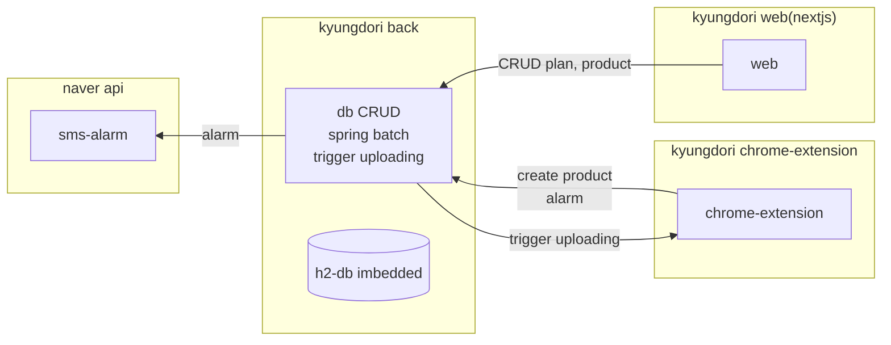

# kyungdori 프로젝트

```mermaid
graph RL
    subgraph "kyungdori chrome-extension"
    chrome-extension
    end

    subgraph "kyungdori web(nextjs)"
    web
    end

    subgraph "kyungdori back"
    back[db CRUD\nspring batch\ntrigger uploading]
    h2-db[(h2-db imbedded)]
    end

    subgraph "naver api"
    alarm[sms-alarm]
    end

    chrome-extension --> |create product\nalarm|back
    back --> |trigger uploading|chrome-extension
    web --> |CRUD plan, product|back
    back --> |alarm|alarm
```
